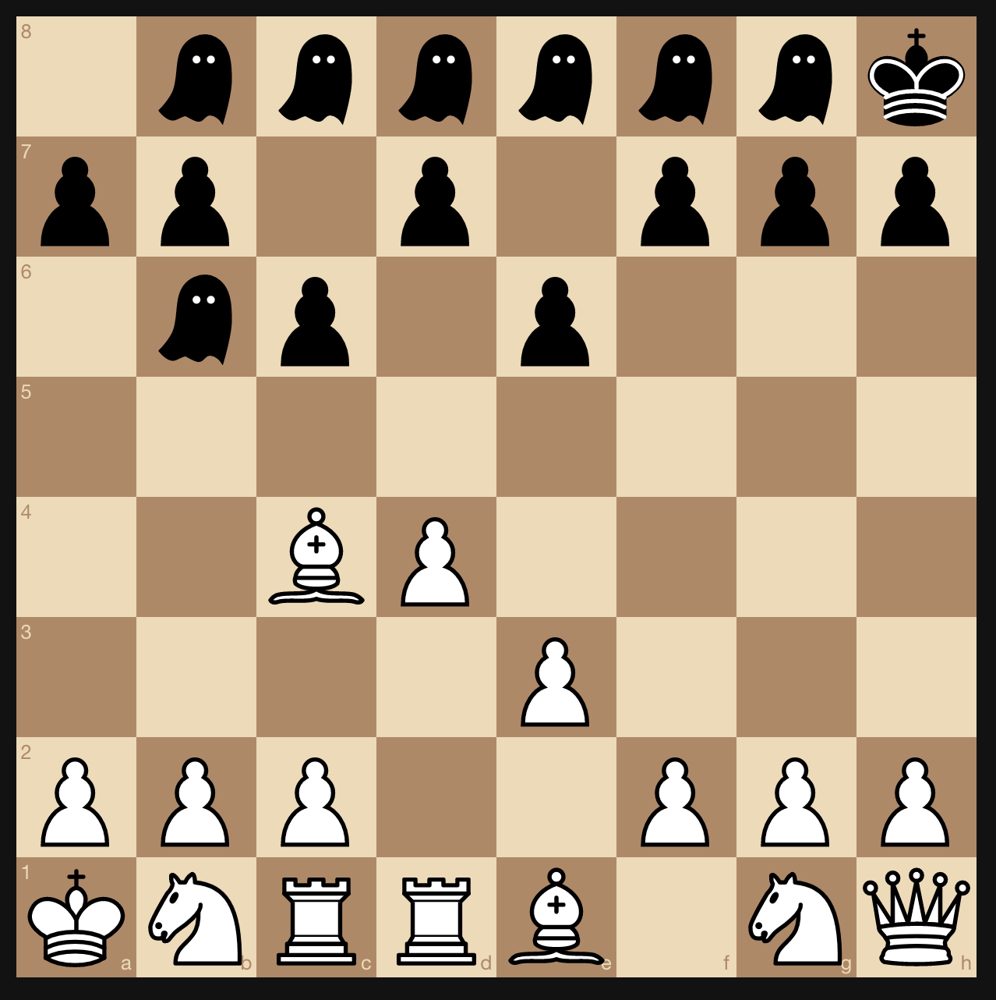

# zkFischer

**Play here:** [https://zk-fischer.vercel.app/](https://zk-fischer.vercel.app/) (only one active game at a time, globally)



zkFischer is a variant of [Fischer random chess](https://en.wikipedia.org/wiki/Fischer_random_chess) using zkSNARKs.

In this variant, you start by rearranging your back rank however you want. All pieces will be kept secret except for your king. During gameplay, you will generate ZKPs to show that you are only making valid moves. The game ends when a king is captured.

Currently, there is no pawn promotion or en passant due to hitting contract bytecode size limitations. There is also no castling, 3-fold repetition, or 50 move rule. It is legal to move your king into check.

Polygon mainnet contracts:
```
"polygon_VerifyPlacementVerifier": "0x91Dd7378A3176382f1c07EdD0444e99B4b412890",
"polygon_VerifyMoveVerifier": "0x49E2410704126E5d59bf75E1bd822A6c4fe34491",
"polygon_zkFischer": "0x76c8adbE58E2E0078F999051E4235429962A9152"
```

Harmony devnet contracts:
```
"devnet_VerifyPlacementVerifier": "0xa414216B4350be4F268DC5Ce85b4DfbD6342c2C1",
"devnet_VerifyMoveVerifier": "0x052Cc560E7B50DE11F754d2fe20A6857bedC8ceF",
"devnet_zkFischer": "0x0530f1E594931d8F33E4718fFB0909635D6c02b8",
```

Boilerplate sources:
* https://github.com/socathie/zkApp/
* https://github.com/enu-kuro/zku-final-project/

**Play here:** [https://zk-fischer.vercel.app/](https://zk-fischer.vercel.app/) (only one active game at a time, globally)


## Building

In `hardhat/`, run `npm i` and `npm run test:full`. In `ui/`, run `npm i` and `npm run copy`.

To deploy to devnet, create `hardhat/.env` and add `HARMONY_PRIVATE_KEY=yourKey`. Then run `npx hardhat deploy --network devnet`. To test locally, go to `hardhat/` and run `npx hardhat node`.

Manually update `ui/src/artifacts/address.json` with your contract addresses and run `npm start`. Depending on your network, you may have to update some network specific configs in `ui/src/`.

## Mechanism

zkFischer uses two circuits: `verifyPlacement` and `verifyMove` (both in `hardhat/circuits`).

When a player initially sets up their board, they must send the contract a ZKP using `verifyPlacement` to prove that their setup is valid (2 rooks, 2 knights, etc). Their hashed board setup is committed to the contract.

During gameplay, the contract keeps track of which squares are occupied by revealed pieces (i.e. pawn or king) and which are occupied by hidden ones. When a player moves a hidden piece, they must send the contract a ZKP using `verifyMove` showing that this piece's starting location (public info from game history) is consistent with the type of move it tried to make (e.g. diagonal implies bishop or queen) and the owner's committed board setup hash.

Both circuits include a public `gameKey` input and private `boardSetupKey` input to thwart rainbow attacks.

TODO: `gameKey` is currently hardcoded to 0 due to hitting a contract size limit.
